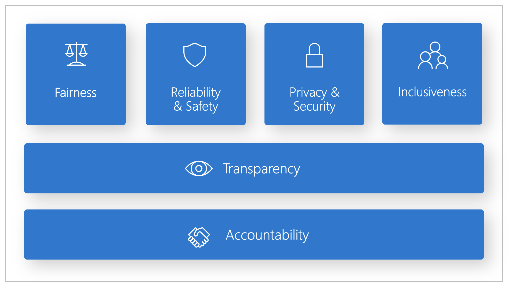

Welcome to the kickoff of my latest project - a Responsible AI Cookbook. This is a personal learning project to explore the increasingly critical area of responsible AI - from core concepts and principles, to developer tools and workflows - with specific focus on the **generative AI applications** ecosystem. In this first post, I'll set the stage by defining a roadmap for what I want to learn, and explaining why I want to use the #30Days model for building a cookbook for developers.

## What This Post Covers:
 * What is Responsible AI and why learn about it?
 * What is my #30DaysOf Learning Roadmap?
 * What does the Cookbook format provide?
 * How does this relate to Generative AI?
 * Resource Collection: [**Responsible AI For Developers**](https://aka.ms/rai-hub/collection)

---

## 1. Background

As an AI Advocate at Microsoft, I've spent the last six months exploring different aspects of the Generative AI landscape - from [Prompt Engineering](https://dev.to/azure/prompt-engineering-fundamentals-generative-ai-for-beginners-v1-1kii) and [Fine Tuning](https://dev.to/azure/fine-tuning-fundamentals-generative-ai-for-beginners-v2-3lf9) fundamentals to [Code-first Development](https://techcommunity.microsoft.com/t5/ai-ai-platform-blog/a-code-first-experience-for-building-a-copilot-with-azure-ai/ba-p/4058659) using Azure AI Studio. But it wasn't till I started working on a [Responsible AI Hub For Developers](https://dev.to/azure/responsible-ai-for-developers-resources-for-self-guided-learning-3lf9) that I realized how _responsible AI_ became critical to every step of the end-to-end development workflow (LLM Ops) for generative AI solutions. 

And while there was a lot of information about responsible AI, it was scattered across different locations - from open-source toolboxes for data scientists, to cloud-based integrations for operationalization, and community-based forums for discussing real-world case studies and best practices. I needed a way to explore this in a _structured_ manner, and build myself a "cookbook" of useful recipes that I could revisit to find the right tool or process for a given task.

## 2. What is Responsible AI?

Responsible AI is a [fundamental approach](https://responsibleaitoolbox.ai/) to designing, developing, assessing, and deploying, AI solutions in a **safe, trustworthy and ethical manner**. Microsoft has an organization-wide [Responsible AI](https://www.microsoft.com/ai/responsible-ai) standard and playbook anchored by six principles:
1. **Fairness** - AI systems should treat all people fairly.
1. **Reliability and Safety** - AI systems should perform reliably and safely (even under unplanned conditions).
1. **Privacy and Security** - AI systems should be secure and respect privacy (think system security and user data privacy)
1. **Inclusiveness** - AI systems should empower everyone and engage people (think about accessible experiences)
1. **Transparency** - AI systems should be understandable. (think about interpretability and explainability for decisions)
1. Accountability - People should be accountable for AI systems (think about oversight and guardrails for ensuring compliance)

My perspective here is that we need to _shift left_ in the application lifecycle when it comes to detecting and mitigating or eliminating potential harms that can adversely impact responsible AI usage. And that means raising **developer awareness** of these issues and documenting **actionable recipes** that can be integrated into their design thinking and developer workflows.

## 3. My #30Days Roadmap

My #30DaysOf platform and process started off as a way to create _themed month_ content to give learners a deep-dive into a given topic in the span of four weeks. However, I want to repurpose the format for _self-paced learning_ by keeping the same structure (roadmap) but without the time pressure for completion (30 days). The _Cookbook_ format seemed to work best:

1. The #30Days site becomes a developer cookbook for a given topic.
1. The Roadmap is the table-of-contents, organized as top-level collections.
1. The Collection is a set of recipes focused on a particular sub-topic.
1. Each Recipe has an explainer (what is it) and an exercise (how do I use it).

My immediate goal is to build this cookbook **for my own use** - all mistakes and misconceptions are mine and the content is intended for learning purposes only and not for production use. With that in mind, my first steps are to find all relevant learning resources and organize them into a hierarchical roadmap (tree of nodes) with the following top-level nodes:
 - Core Concepts - understand key terminology and building blocks
 - Developer Tools - explore key tools and workflows for developers
 - Generative AI - understand Responsible AI usage for LLM Ops
 - Advanced Topics - covers research, best practices & new projects.

## 4. Generative AI and LLM Ops

Traditional AI applications focused on training models with domain-specific datasets, and deploying _predictive AI_ endpoints that applications could use for decision-making. Modern _generative AI_ applications focus on pre-trained "large language models" trained on massive internet-scale data, with endpoints that applications can use for generating original content (text, code, images, audio, video etc.). 

This unlocks a whole new range of user experiences driven by _natural language_ interactions (chat), driving a paradigm shift from MLOps to LLMOps. In my day job as an AI Advocate at Microsoft, I focus on how we can use the [Azure AI platform](https://ai.azure.com) to streamline the end-to-end development of Generative AI applications - and use this figure to explain what the LLM Ops (or end-to-end application lifecycle) would involve.

When we think about Responsible AI in the context of this workflow, we have to [plan a responsible generative AI solution](https://learn.microsoft.com/training/modules/responsible-generative-ai/2-plan-responsible-ai) with 4 steps:
 - _Identify_ potential harms relevant to your solution
 - _Evaluate_ presence of harms in generated outputs
 - _Mitigate_ harms at multiple levels to minimize impact
 - _Operate_ solution responsibly with an ops readiness plan.

 With the Azure AI platform, this is captured in the [approach to generative AI evaluations](https://learn.microsoft.com/azure/ai-studio/concepts/evaluation-approach-gen-ai), the [responsible AI guidelines for Azure AI services](https://learn.microsoft.com/azure/ai-services/responsible-use-of-ai-overview) and the [content filtering system](https://learn.microsoft.com/azure/ai-studio/concepts/content-filtering)for deployments. 

The figure above gives us a high-level sense for where these mechanisms fit against the three stages in the LLM Ops diagram above. And just last week, the team announced [new tools for building secure and trustworthy generative AI applications](https://azure.microsoft.com/blog/announcing-new-tools-in-azure-ai-to-help-you-build-more-secure-and-trustworthy-generative-ai-applications/) that enhance the workflow even more to tackle challenges like prompt injection attacks, vulnerability to jailbreaking, detection of "hallucinations" and more.

## 5. Next Steps

My next step is to build a roadmap (table of contents with links to relevant resources) to help me plan out my learning journey. Stay tuned!